# RTOS
## I. Reference
- document : 
- video    : [play list youtube](https://www.youtube.com/playlist?list=PL831drV1RoWvU3AIoOKzeoz9AD625a97V) 
- Software 
    - IDE      : [STM32CubeIDE]() | [Keilcv5]() & [STM32CubeMx]()
    - other    : [SEGGER SystemView]()
- RTOS     : [FreeRTOS]()
- Board    : STM32F407 Discovery | NUCLEO-F446RE

## II. Add FreeRTOS lib into STM32IDE
- add FreeRTOS folder into project
    - in portable folder delete all folders exept GCC and MemMang
- add Config folder into project
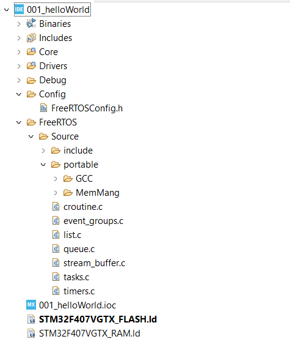
- add Include part 
    - open Properties(alt+enter) => C/C++ General => Paths and Symbols => add include Include direcrories
- add Source location
    - open Properties => C/C++ General => Paths and Symbols => Source location
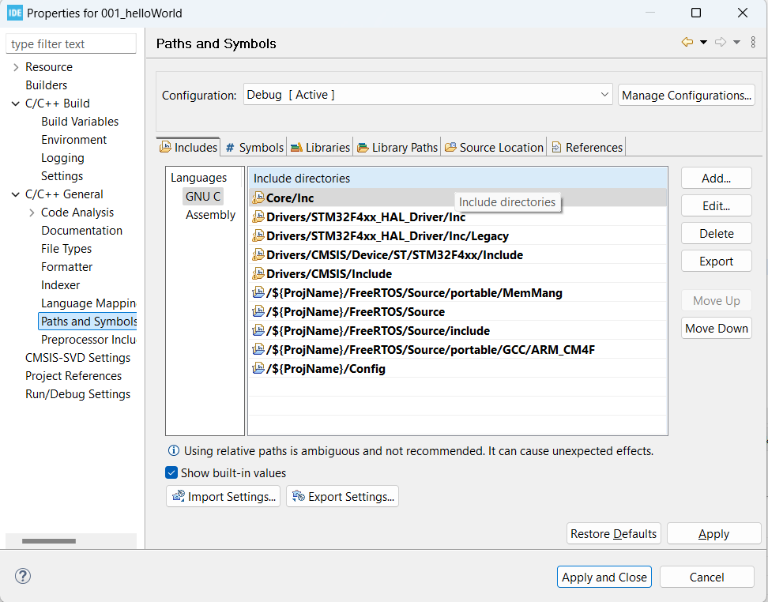
- Configura Macros
    - configSUPPORT_DYNAMIC_ALLOCATION 1
- `` note fix error: `` [video](https://www.youtube.com/watch?v=Ksjdh0KAEi0&list=PLxGj5QMILu9GIB2PIgY_8RoRpRPOLvQ3J&index=5)

## III. Introduction
### 1. Real Time Applications (RTAs)
- RTAs không phải là ứng dụng thực thi nhanh
- RTAs là một ứng dụng xác định thời gian. Có nghĩa là thời gian đáp ứng của các sự kiện là không đổi(độ lệch trong RTAs rát nhỏ tính bằng ms hoặc s trong Soft real time)
- đối với các ứng dụng Hard real time phải hoàn thành trong một khoảng thời gian giới hạn. nếu không thực hiện được sẽ dẫn đến lỗi hệ thống
### 2. Real Time OS
- Đây là một hệ điều hành được thiết kế đặc biệt để chạy các ứng dụng với thời gian rất chính xác và mức độ tin cậy cao.
- Để được coi là "thời gian thực", một hệ điều hành phải có thời gian tối đa đã biết cho mỗi hoạt động quan trọng mà nó thực hiện. Một số hoạt động này bao gồm
    - Xử lý các ngắt và ngoại lệ hệ thống nội bộ 
    - Xử lý các phần quan trọng 
    - Cơ chế lập lịch, v.v. 

### 3. RTOS vs GPOS 
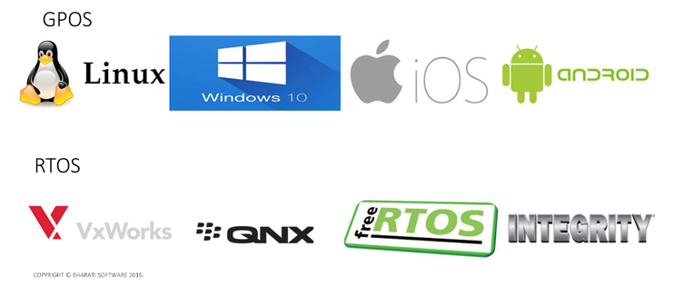 
#### 3.1. Task Scheduling 
- GPOS
    - Việc lập lịch tác vụ không phải lúc nào cũng dựa trên "mức độ ưu tiên"
    - GPOS được lập trình để xử lý việc lập lịch theo cách mà nó có thể đạt được thông lượng(Throughput) cao. 
    - Trong GPOS, trình lập lịch thường sử dụng chính sách công bằng để phân phối luồng và quy trình vào CPU. 
    - Chính sách như vậy cho phép thông lượng tổng thể cao theo yêu cầu của các ứng dụng máy tính để bàn và máy chủ, nhưng không đảm bảo rằng các luồng hoặc quy trình có mức độ ưu tiên cao, quan trọng về thời gian sẽ thực thi thay vì các luồng có mức độ ưu tiên thấp hơn. 
- RTOS
    - Hầu hết sử dụng phương pháp lập lịch tác vụ ưu tiên dựa trên mức độ ưu tiên 
    - Mặt khác trong RTOS, các luồng thực thi theo thứ tự ưu tiên của chúng. Nếu một luồng có mức độ ưu tiên cao sẵn sàng chạy, nó sẽ tiếp quản CPU từ bất kỳ luồng có mức độ ưu tiên thấp nào có thể đang thực thi.  
    - Tại đây, một luồng có mức độ ưu tiên cao sẽ được thực thi trên các luồng có mức độ ưu  lên thấp. Tất cả "thực thi luồng có mức độ ưu tiên thấp" sẽ bị tạm dừng. Thực thi luồng có mức độ ưu tiên cao sẽ
chỉ được ghi đè nếu một yêu cầu đến từ một luồng có mức độ ưu tiên cao hơn.
- ``note``
    - Thông lượng có nghĩa là  tổng số quy trình(Process) hoàn tất việc thực thi của chúng trên một đơn vị thời gian
- `` summary`` 
    - Đối với RTOS, việc đạt được khả năng dự đoán hoặc bản chất xác định thời gian quan trọng hơn so với thông lượng 
    - đối với GPOS, việc đạt được thông lượng cao hơn để thuận tiện cho người dùng quan trọng hơn 

#### 3.2. Task Switching Latency
- Trong Máy tính, Độ trễ(Latency) có nghĩa là Thời gian trôi qua giữa một kích thích và phản ứng với nó.
- Độ trễ chuyển đổi tác vụ(Task Switching Latency) có nghĩa là khoảng thời gian giữa Sự kích hoạt của một sự kiện và thời điểm mà tác vụ xử lý sự kiện đó được phép chạy trên CPU
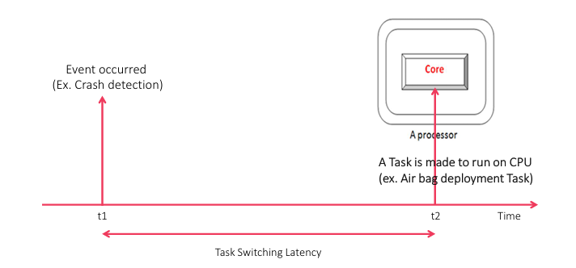 
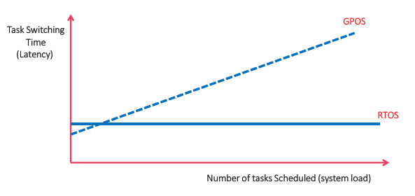

#### 3.3. Priority Inversion
- Hiệu ứng đảo ngược ưu tiên (Priority Inversion) có nghĩa là khi một task vụ đang trong quá trình sử dụng tài nguyên thì một task khác có mức ưu tiên cao hơn truy nhập. Task có mức độ ưu tiên cao hơn không thể thay thế cho task trước đó  
    - đối với GPOS: Hiệu ứng đảo ngược ưu tiên(Priority Inversion) không đáng kể
    - đối với RTOS: Hiệu ứng đảo ngược ưu tiên(Priority Inversion) phải được giải quyết

#### 3.4. Kernel Preemption
- Quyền ưu tiên(Preemption)
    - Trong tính toán, quyền ưu tiên là hành động tạm thời xóa tác vụ khỏi trạng thái đang chạy mà không cần sự hợp tác của tác vụ đó
- Trong RTOS 
    - các luồng thực thi theo thứ tự ưu tiên của chúng. Nếu một luồng có mức độ ưu tiên cao sẵn sàng để chạy, trong một khoảng thời gian nhỏ và giới hạn, nó sẽ tiếp quản CPU từ bất kỳ luồng có mức độ ưu tiên thấp hơn nào có thể đang thực thi mà chúng ta gọi là quyền ưu tiên.
    - Tác vụ có mức độ ưu tiên thấp hơn sẽ được thực hiện để rời khỏi CPU, nếu tác vụ có mức độ ưu tiên cao hơn muốn thực thi
    - Các hoạt động của hạt nhân(Kernel) RTOS có thể được chiếm đoạt trước
- Đối với GPOS
    - hạt nhân GPOS không thể được chiếm đoạt trước 
### 4. Multi-tasking
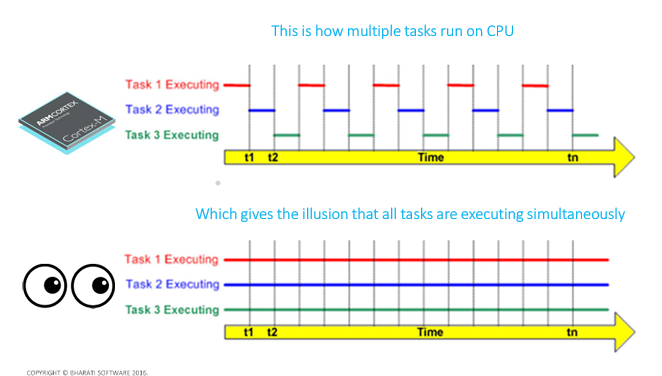

## IV. Task
### 1. Trạng thái của task
- trong RTOS trạng thái của Task có thể chia thành 4:
    - Runing: Task đang được thực thi bởi CPU
    - Ready: Task đã sẵn sàng để chạy, nhưng chưa được CPU chọn (vì đang có Task khác ưu tiên cao hơn đang chạy).
    - Block: Task đang chờ một sự kiện nào đó để tiếp tục chạy như delay, semaphone, notify, ...
    - Suspended: Task bị tạm dừng bởi hàm gọi trực tiếp từ chương trình như vTaskSuspend()

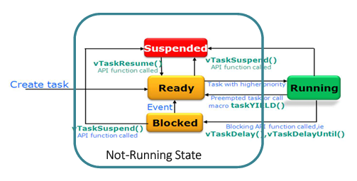

### 2. Mức độ ưu tiên của task
- Processor Interrupt/Exception Priority : giá trị càng thấp thì các ngắt mức độ ưu tiên càng cao và ngược lại
- FreeRTOS Task Priority : giá trị ưu tiên càng cao thì Task có mức ưu tiên càng cao tương ứng

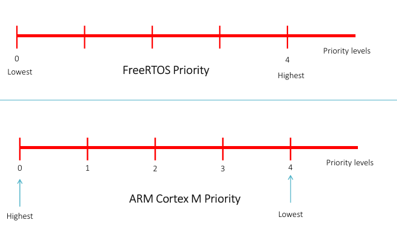
#### 2.2. Task Priority APIs
##### vTaskPrioritySet
``` c
void vTaskPrioritySet( xTaskHandle pxTask, unsigned portBASE_TYPE  uxNewPriority );
```
##### uxTaskPriorityGet
``` c
unsigned portBASE_TYPE uxTaskPriorityGet( xTaskHandle  pxTask );
```

### 3. Idle Task 
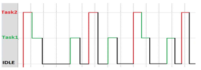
- Idle Task được tự động tạo ra khi trình lập lịch RTOS được khởi động để đảm bảo luôn có ít nhất một nhiệm vụ có thể chạy.
- Task này được tạo ở mức ưu tiên thấp nhất đảm bảo không sử dụng bất kỳ tài nguyên CPU nào. Nhường CPU cho các task có mức ưu tiên cao hơn ở trạng thái sẵn sàng.
- Idle Task có trách nhiệm giải phóng bộ nhớ được RTOS phân bổ cho các Task đã bị xóa
- Có thể cung cấp một hàm Hook ứng dụng trong tác vụ nhàn rỗi để đưa CPU đến chế độ năng lượng thấp khi không có tác vụ hữu ích nào đang thực thi.

### 4. FreeRTOS Timer Services Task (Timer Daemon Task)
- Xuất hiện khi sử dụng software timers
- Tác vụ này được tạo tự động khi trình lập lịch được khởi động và Macro `configUSE_TIMERS` 1 
- đươc RTOS sử dụng để quản lý software timers FreeRTOS và gọi các Callback của software timers tương ứng đã đăng ký.

### 5. Task APIs
#### 1. xTaskCreate
``` C
BaseType_t xTaskCreate( TaskFunction_t vATaskFuntion,
                        const char * const pcName,
                        const short uxStackDepth,
                        void * const pvParameters,
                        UBaseType_t uxPriority,
                        TaskHandle_t * const pxCreatedTask );
/*
    @param[pxTaskCode]    : hàm xử lý của task 
    @param[pcName]        : tên của task
    @param[uxStackDepth]  : độ dài của stack cho task
    @param[pvParameters]  : tham số truyền vào cho hàm pxTaskCode
    @param[uxPriority]    : mức ưu tiên của task 
    @param[pxCreatedTask] : Task handle chúa thông tin của task được tạo

    @retval : trả về
    note : có thẻ sử dụng hàm để kiểm tra API có thành công hay không
*/
```
- `Note:` Sau khi gọi API các thông tin của Task mới sẽ được lưu trong Heap trên RAM

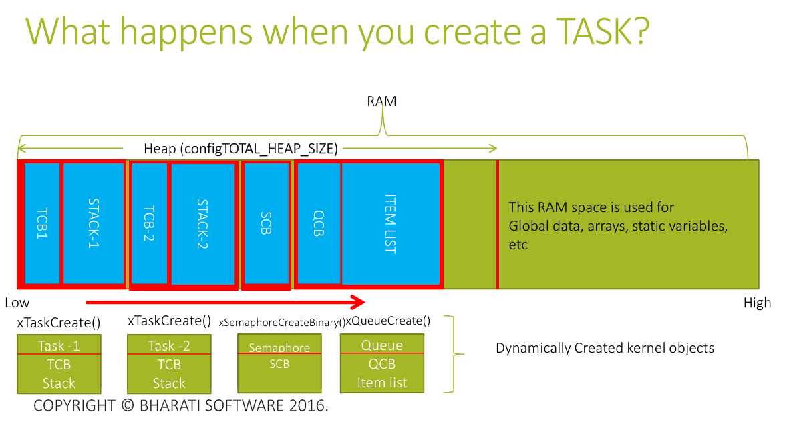


#### 2. vTaskDelete

``` C
void vTaskDelete( xTaskHandle *pxTaskToDelete );
/*
    @param[pxTaskToDelete] : 
*/
```

#### 3. Task Implementation Function
``` C
void vATaskFuntion(void *arg)
{
    // code
    while(1)
    {
        // code
    }
    vTaskDelete(NULL);    
}
```

## V. Task Scheduling 
### 1. Trình lập lịch (Scheduler)
- Scheduler là một phần của mã hạt nhân(Kernel) chịu trách nhiệm quyết định tác vụ nào sẽ được thực thi tại bất kỳ thời điểm cụ thể nào trên CPU.
- Công việc cơ bản của trình lập lịch là xác định tác vụ tiềm năng tiếp theo sẽ chạy trên CPU

### 2. Chính sách lập lịch (Scheduling Policies)
- Chính sách lên lịch là thuật toán được trình lên lịch sử dụng để quyết định tác vụ nào sẽ thực thi tại bất kỳ thời điểm nào.
- có 2 loại chính sách chính:
    - Priority based Pre-Emptive Scheduling:  trình lập lịch sẽ dựa vào mức độ ưu tiên của task để xác định thứ tự task chạy 
    - co-operative Scheduling: trình lập lịch dựa trên sư hợp tác. các task được chính người dùng lập thức tự chạy
- Macro `configUSE_PREEMPTION` trong freeRTOSConfig.h quyết định chính sách lên lịch trong freeRTOS:
    - Nếu configUSE_PREEMPTION = 1 // Priority based Pre-Emptive Scheduling. 
    - Nếu configUSE_PREEMPTION = 0 // o-operative Scheduling
- Pre-emptive Scheduling : là hành động tạm thời ngắt một tác vụ đang thực thi với mục đích loại bỏ tác vụ đó khỏi trạng thái đang chạy mà không cần sự hợp tác của tác vụ đó.
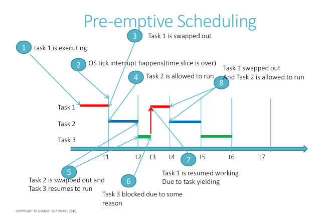

#### 3. API xTaskStartScheduler
``` C
void xTaskStartScheduler(void);
```
- API được gọi khi toàn bộ Task đã hoàn tất quá trình khởi tạo. 
- API được triển khai trong tasks.c của hạt nhân(Kernel) FreeRTOS có nhiệm vụ:
    - Khởi động trình lập lịch RTOS
    - Cấu hình bộ đếm thời gian SysTick theo configTICK_RATE_HZ trong FreeRTOSConfig.h
    - Cấu hình mức độ ưu tiên cho các ngắt PendSV và Systick. 
    - Thực thi lệnh SVC để chạy task đầu tiên.    

## VI. Task delay
- ``note`` Không bao giờ sử dụng triển khai trễ dựa trên vòng lặp for, điều này làm tiêu tốn CPU mà không thực hiện bất kỳ công việc thực sự nào vẫn sẽ ngăn chặn bất kỳ tác vụ khác
### APIs
#### 1. vTaskDelay 
- chặn task xTicksToDelay(tick) kể từ lần gọi
``` c
void vTaskDelay( const TickType_t xTicksToDelay );
```
#### 2. xTaskDelayUntil
    - xTaskDelayUntil tạo ra tần số delay chính sác
    - API unblock task sau (*pxPreviousWakeTime + xTimeIncrement)
<!--     - API có thể trả về ngay lập tức nếu  -->
``` C
BaseType_t xTaskDelayUntil( TickType_t * const pxPreviousWakeTime, const TickType_t xTimeIncrement );
/*
    @param[pxPreviousWakeTime] : Con trỏ đến một biến lưu trữ thời gian mà tác vụ được bỏ chặn lần cuối. 
    Biến phải được khởi tạo với thời gian hiện tại trước lần sử dụng đầu tiên.
    Sau đó, biến được tự động cập nhật trong xTaskDelayUntil().
    @param[xTimeIncrement] : Chu kỳ thời gian. Task sẽ được bỏ chặn tại thời điểm (*pxPreviousWakeTime + xTimeIncrement)
*/
```
- `` note ``: chuyển đổi ms->tick: tick = ms/portTICK_PERIOD_MS

## VII. Context Switching 
### 1. Context Switching
- Chuyển đổi ngữ cảnh (Context Switching) là quá trình chuyển đổi từ tác vụ sang một tác vụ khác trên CPU để thực thi.
- Trong RTOS, Chuyển đổi ngữ cảnh được xử lý bởi Trình lập lịch.

- Nếu trình lập lịch là trình lập lịch ưu tiên dựa trên mức độ ưu tiên, thì đối với mỗi lần chuyển đổi, trình lập lịch sẽ so sánh mức độ ưu tiên của tác vụ đang chạy với mức độ ưu tiên của danh sách các tác vụ đã sẵn sàng. Nếu có bất kỳ tác vụ đã sẵn sàng nào có mức độ ưu tiên cao hơn tác vụ đang chạy thì chuyển đổi ngữ cảnh sẽ xảy ra.
- Trên FreeRTOS, Có thể kích hoạt chuyển đổi ngữ cảnh theo cách thủ công bằng cách sử dụng macro ``taskYIELD()``
- Chuyển đổi ngữ cảnh cũng xảy ra ngay lập tức bất cứ khi nào tác vụ mới bỏ chặn và nếu mức độ ưu tiên của nó cao hơn tác vụ đang chạy hiện tại.
### 2. Task State 

### 3. ARM Cortex Mx Core registers 
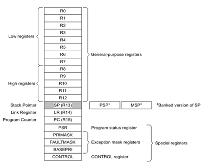
### 4. Stacks 
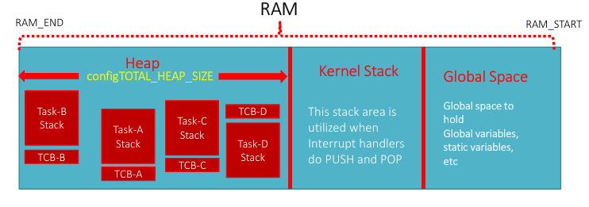
- Có 2 loại bộ nhớ Stack được sử dụng trong thời gian chạy của ứng dụng dựa trên FreeRTOS
    - Kernel Stack: chứa dữ liệu của kernel
    - Task's Stack: chứa thông tin của task đó nằm trong heap section
### 5. Quá trình tạo task
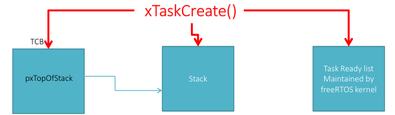
- TCB sẽ được khởi tạo trong RAM(Heap section)
- Bộ nhớ Stack chuyên dụng sẽ được khởi tạo cho một tác vụ. Bộ nhớ stack này sẽ được theo dõi bằng thanh ghi PSP.
- Task sẽ được đưa vào danh sách Sẵn sàng để người lập lịch chọn

### 6. Kernel interrupt tham gia vào quá trình chuyển đổi ngữ cảnh
- Khi FreeRTOS chạy trên MCU dựa trên Bộ xử lý ARM Cortex Mx, các ngắt dưới đây được sử dụng để triển khai Lên lịch tác vụ.    
    - Ngắt SVC - vPortSVCHandler(): được sử dụng để khởi chạy Tác vụ đầu tiên
    - Ngắt PendSV - vPortPendSVHandler(): thực hiện chuyển đổi ngữ cảnh giữa các tác vụ
    - Ngắt SysTick - xPortSysTickHandler(): quản lý bộ đếm Tick trong RTOS
- ``note`` 
    - Tất cả các ngắt được định cấu hình ở mức ưu tiên ngắt thấp nhất có thể.
- configKERNEL_INTERRUPT_PRIORITY: cấu hình mức độ ưu tiên ngắt hạt nhân và được đặt ở mức độ ưu tiên ngắt thấp nhất có thể.

### 6. Quá trình chuyển đổi Ngữ cảnh
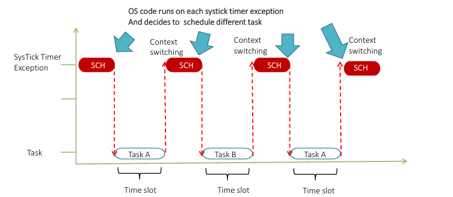
#### quá trình Task out
Trước khi tác vụ được chuyển đổi, cần lưu ý những điều sau.
- Các thanh ghi lõi bộ xử lý R0, R1, R2, R3, R12, LR, PC, xPSR (khung ngăn xếp) được lưu tự động vào ngăn xếp riêng của tác vụ bởi trình tự nhập ngắt SysTick của bộ xử lý.
- Nếu cần Chuyển đổi ngữ cảnh thì bộ đếm thời gian SysTick sẽ chờ Ngoại lệ PendSV và trình xử lý PendSV chạy
- Các thanh ghi lõi bộ xử lý (R4-R11, R14) phải được lưu thủ công vào bộ nhớ ngăn xếp riêng của tác vụ (Lưu ngữ cảnh)
- Lưu giá trị đầu ngăn xếp mới (PSP) vào thành viên đầu tiên của TCB
- Chọn Nhiệm vụ tiềm năng tiếp theo để thực thi trên CPU. Được chăm sóc bởi vTaskSwitchContext() được triển khai trong tasks.c
1. Exception Entry 
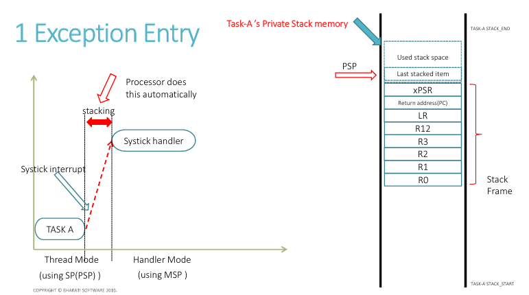
2. PendSV Handler Entry

3. Save core registers 
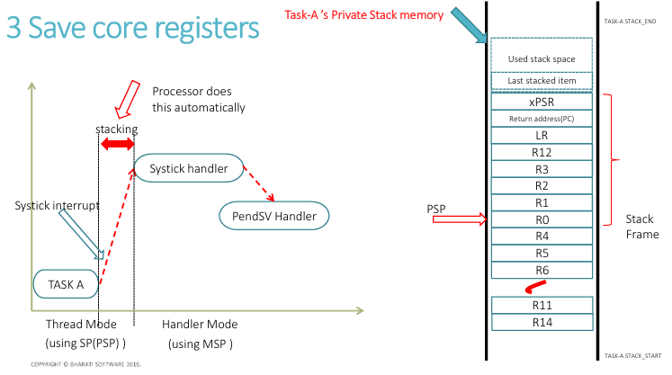
4. Save PSP Into TCB 
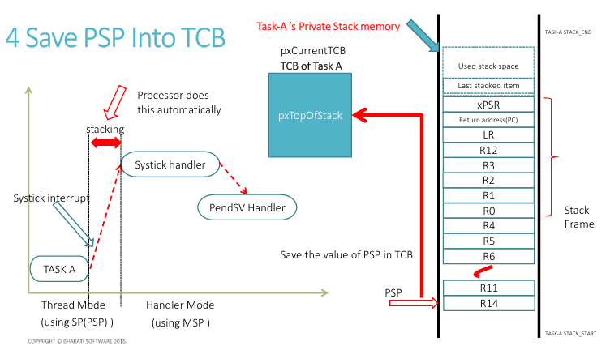

#### Quá trình Task in
Vì vậy, tại thời điểm này, chúng ta đã biết tác vụ nào (TCB) nên được
chuyển đổi trong. Điều đó có nghĩa là TCB của tác vụ có thể chuyển đổi mới có thể được truy cập
bởi pxCurrentTCB
- Trước tiên, hãy lấy địa chỉ của đỉnh ngăn xếp. Sao chép giá trị của
pxTopOfStack vào thanh ghi PSP
- Đưa tất cả các thanh ghi (R4-R11, R14) (Khôi phục ngữ cảnh)
- Thoát ngoại lệ: Bây giờ PSP đang trỏ đến địa chỉ bắt đầu của
khung ngăn xếp sẽ tự động được đưa ra do
thoát ngoại lệ

1. Load PSP 
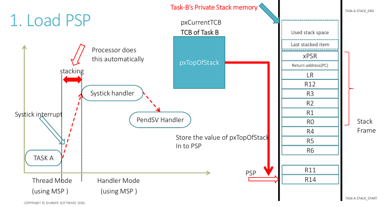
2. POP all Core Registers
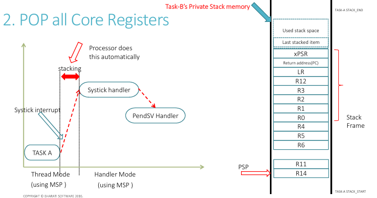
3. Exception Exit 
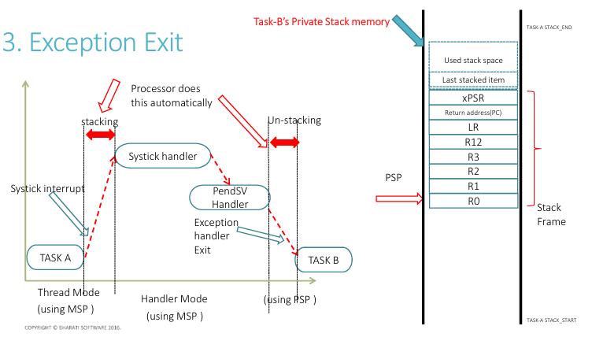

## VIII. cơ chế đồng bộ và chia sẻ dữ liệu
### 1. Task Notification
- Task Notification là một cơ chế rất nhẹ và hiệu quả để giao tiếp hoặc đồng bộ giữa Task-Task hoặc IRS-Task. 
- Mỗi tác vụ RTOS có 32 bit giá trị thông báo và được khởi tạo thành 0 khi tác vụ RTOS được tạo
- có 2 quá trình chính: thông báo(Notify) và chờ(wait)
#### APIs
##### 1. xTaskNotifyWait
- Khi tác vụ gọi đên xTaskNotifyWait(), thì nó sẽ đợi(block) cho đến khi hết thời gian chờ(xTicksToWait) hoặc nhận được thông báo từ ISR hoặc tác vụ khác
``` c
BaseType_t xTaskNotifyWait ( uint32_t ulBitsToClearOnEntry,  uint32_t  ulBitsToClearOnExit, uint32_t  *pulNotificationValue,  TickType_t  xTicksToWait ); 
/*
    @param[ulBitsToClearOnEntry] : Bất kỳ bit nào được đặt trong ulBitsToClearOnEntry sẽ bị xóa khi gọi giá trị thông báo của tác vụ RTOS gọi khi truy nhập hàm xTaskNotifyWait()
    @param[ulBitsToClearOnExit]  : Bất kỳ bit nào được đặt trong ulBitsToClearOnExit sẽ được xóa trong giá trị thông báo của tác vụ RTOS đang gọi trước khi hàm xTaskNotifyWait() thoát
    @param[pulNotificationValue] : Được sử dụng để nhận giá trị thông báo từ xTaskNotify của tác vụ RTOS muốn truyền. Nếu giá trị thông báo này không cần thiết đặt giá trị về NULL
    @param[xTicksToWait]         : Thời gian tối đa nhận thông báo
    // ms chuyển đổi tick = (ms/configTICK_RATE_HZ)/1000

    @retval : pdTRUE nếu đã nhận được thông báo. pdFALSE nếu sảy ra TIMEOUT
*/
```

##### 2. xTaskNotify() 
- xTaskNotify() được sử dụng để gửi sự kiện trực tiếp đến và bỏ chặn các tác vụ RTOS tiềm năng, tùy chọn cập nhật giá trị thông báo của tác vụ nhận theo một trong những cách sau:
    - Viết một số 32 bit vào giá trị thông báo
    - Thêm một (tăng) giá trị thông báo
    - Đặt một hoặc nhiều bit trong giá trị thông báo
    - Giữ nguyên giá trị thông báo
``` C
BaseType_t xTaskNotify( TaskHandle_t  xTaskToNotify, uint32_t  ulValue,  eNotifyAction eAction );
/*
    @param[xTaskToNotify] : trỏ đến RTOS task vụ được thông báo
    @param[ulValue]       : Được sử dụng để cập nhật giá trị thông báo của tác vụ chủ đề
    @param[eAction]       : 
        - eNoAction 
        - eIncrement 
        - eSetValueWithOverwrite

    @retval :
*/
```

### 2. Event Group 
- Event Group(Event Flags) là một cơ chế đồng bộ hóa giữa các Task hoặc giữa Task và ISR. Nó cho phép nhiều Task chờ (wait) cùng một hoặc nhiều sự kiện xảy ra.
- configUSE_16_BIT_TICKS là một macro được sử dụng để định cấu hình độ dài của kiểu dữ liệu được sử dụng để lưu trữ số lượng tick(flag) của hệ thống.
    - Nếu configUSE_16_BIT_TICKS 1, TickType_t <=> 16-bit .
    - Nếu configUSE_16_BIT_TICKS 0 , TickType_t <=> 32-bit 

#### APIs
##### 1. xEventGroupCreate
``` C
/**
 * @brief: Cấp phát động Event Group 
 * @reval: Nếu nhóm sự kiện đã được tạo thì một xử lý đến nhóm sự kiện sẽ được trả về.
             Nếu không có đủ heap FreeRTOS để tạo nhóm sự kiện thì NULL sẽ được trả về. 
*/
EventGroupHandle_t xEventGroupCreate( void );
/**
 * @brief: cấp phát tĩnh Event Group
*/
EventGroupHandle_t xEventGroupCreateStatic( StaticEventGroup_t *pxEventGroupBuffer );
```
##### 2. xEventGroupWaitBits
``` C
/**
 * @param[xEventGroup]
 * @param[uxBitsToWaitFor]: các bit mà Task muốn chờ.
 * @param[xClearOnExit]: nếu pdTRUE, thì bit sẽ bị xóa sau khi Task thoát khỏi chờ.
 * @param[xWaitForAllBits]:
        - pdTRUE: Task chỉ tiếp tục khi tất cả bit trong uxBitsToWaitFor được set.
        - pdFALSE: Task tiếp tục khi bất kỳ bit nào được set.
 * @param[xTicksToWait]: thời gian timeout
 * @retval:
*/
EventBits_t xEventGroupWaitBits( const EventGroupHandle_t xEventGroup, const EventBits_t uxBitsToWaitFor, const BaseType_t xClearOnExit, const BaseType_t xWaitForAllBits, TickType_t xTicksToWait );
```
##### 3. xEventGroupSetBits
``` C
/**
 * @retval: toàn bộ trạng thái bit hiện tại của Event Group sau khi set.
*/
EventBits_t xEventGroupSetBits( EventGroupHandle_t xEventGroup, const EventBits_t uxBitsToSet );

/**
 * @brief: sử dụng khi giao tiếp ISR và Task
*/
BaseType_t xEventGroupSetBitsFromISR(EventGroupHandle_t xEventGroup, const EventBits_t uxBitsToSet, BaseType_t *pxHigherPriorityTaskWoken);
```

### 3. Mutual exculsion
- nó cho phép chỉ một luồng duy nhất có thể truy cập vào tài nguyên được chia sẻ(shared resource) tại một thời điểm. Điều này tránh được tình trạng xung đột giữa các luồng khi sử dụng tài nguyên chung. Thông thường, phải khóa tài nguyên đó trước khi sử dụng và
mở khóa sau khi bạn hoàn tất việc truy cập tài nguyên.
#### APIs
``` C
pthread_mutex_t mutex = PTHREAD_MUTEX_INITIALIZER; // Cấp phát tĩnh
int pthread_mutex_init(pthread_mutex_t *mutex, const pthread_mutexattr_t *atrr); // cấp phát động note khi không dùng dến phải có quá trình huỷ bỏ (pthread_mutex_destroy)

int pthread_mutex_lock(pthread_mutex_t *mutex);

int pthread_mutex_unlock(pthread_mutex_t *mutex);
```
``` C
// ex
void task1(void)
{
    pthread_mutex_lock(&mutex);
    // shared resource here
    pthread_mutex_unlock(&mutex);
}

```

### 4. Semaphore
- Semaphore là một cơ chế đồng bộ hóa quan trọng để điều phối việc truy cập vào tài nguyên dùng chung giữa các task. Semaphore hoạt động như một biến đếm, có thể được tăng hoặc giảm giá trị.

- có 2 loại semaphore : binary semaphore và counting semaphore
    - Semaphore nhị phân (binary semaphore) : cơ chế giống với mutex Có giá trị là 0 hoặc 1. Thường được dùng để bảo vệ tài nguyên chia sẻ hoặc đồng bộ hóa hai task.     -
    - Semaphore tăng (counting semaphore) : Có giá trị lớn hơn 1. Thường được dùng để quản lý một số lượng tài nguyên có hạn hoặc đếm các sự kiện.

#### Semaphore APIs
##### 1. xSemaphoreCreate
``` C
// binary semaphore
SemaphoreHandle_t xSemaphoreCreateBinary(void);
// counting semaphore
SemaphoreHandle_t xSemaphoreCreateCounting(void):
// Mutex
SemaphoreHandle_t xSemaphoreCreateMutex(void);

```
##### 2. xSemaphoreTake
``` C
/*
    @brief: Yêu cầu một semaphore. Nếu semaphore không có sẵn, task sẽ bị block cho đến khi semaphore có sẵn
    @param[xBlockTime] : thời gian tối đa treo task
*/
BaseType_t xSemaphoreTake(  xSemaphoreHandle xSemaphore, 
                            TickType_t xBlockTime );

/**
 * 
*/
BaseType_t xSemaphoreTakeISR();
```
##### 3. xSemaphoreGive
``` C
/*
    @brief: Trả lại một semaphore.
*/
BaseType_t xSemaphoreGive(xSemaphoreHandle xSemaphore);

/**
 * 
*/
BaseType_t xSemaphoreGiveFromISR()
```
##### 4. vSemaphoreDelete
``` C
void vSemaphoreDelete( SemaphoreHandle_t xSemaphore );
```

### 5. Queue
- Queue (hàng đợi) là cơ chế giao tiếp và đồng bộ Task-Task hoặc ISR-Task trong FreeRTOS dùng để:
    - Trao đổi dữ liệu giữa các Task.
    - Truyền dữ liệu từ ISR sang Task hoặc ngược lại.
- Hoạt động theo cơ chế FIFO (First In – First Out).
    - Mỗi lần send sẽ đưa một bản sao dữ liệu vào Queue.
    - Mỗi lần receive sẽ lấy ra phần tử đầu tiên và xóa khỏi Queue

#### Queue APIs
##### 1. xQueueCreate
``` C
QueueHandle_t xQueueGenericCreate( const UBaseType_t uxQueueLength,
                                       const UBaseType_t uxItemSize,
                                       const uint8_t ucQueueType );
```

##### 2. xQueueSend
``` C
BaseType_t xQueueSend( QueueHandle_t xQueue, const void * pvItemToQueue, TickType_t xTicksToWait );
BaseType_t xQueueSendToFront( QueueHandle_t xQueue, const void * pvItemToQueue, TickType_t xTicksToWait );
BaseType_t xQueueSendFromISR( QueueHandle_t xQueue, const void * pvItemToQueue, BaseType_t *pxHigherPriorityTaskWoken );
```
##### 3. xQueueReceive
``` C
BaseType_t xQueueReceive( QueueHandle_t xQueue, void *pvBuffer, TickType_t xTicksToWait );
BaseType_t xQueueReceiveFromISR( QueueHandle_t xQueue, void *pvBuffer, BaseType_t *pxHigherPriorityTaskWoken );
```

## X. Interrupt Safe and Interrupt Un-Safe 
- Bất cứ khi chương trình thực hiện ngắt phải sử dụng FreeRTOS API có kết thúc bằng từ “FromISR”(Queue_write/Queue_write_FromISR, ...)
- ``note`` : Điều này là do, Khi ở trong Contex ngắt (tức là đang ở giữa việc phục vụ ISR - handler mode), không thể quay lại Bối cảnh tác vụ (tức là tạo tác vụ để chạy bằng cách chiếm trước ISR - thread mode)
- configMAX_SYSCALL_INTERRUPT_PRIORITY: Mục cấu hình mức độ ưu tiên ngắt hệ thống quyết định mức độ ưu tiên tối đa, và cho phép sử dụng những API freertos kết thúc bằng “FromIsr” trong các quy trình dịch vụ ngắt của chúng.
- ``note`` : bất kỳ trình dịch vụ ngắt nào sử dụng API RTOS phải có giá trị ưu tiên được đặt thủ công bằng hoặc lớn hơn giá trị configMAX_SYSCALL_INTERRUPT_PRIORITY được thiết lập

## XI. FreeRTOS HOOK funtion
- HOOK funtion là những hàm đặc biệt mà người dùng tự định nghĩa để OS tự động gọi tại một số sự kiện quan trọng.
### 1. Idle task HOOK function 
- vApplicationIdleHook được thực thi trong Idle Task có thể kết đưa bộ xử lý vào trạng thái năng lượng thấp hoặc thực hiện công việc nền khi CPU rảnh.
- Cấu hình configUSE_IDLE_HOOK đặt thành 1 dể triển khai vApplicationIdleHook
``` C
void vApplicationIdleHook(void);
```
### 2. RTOS tick HOOK function 
- vApplicationTickHook được gọi ở mỗi SysTick interrupt, dùng cho các tác vụ định kỳ rất ngắn gọn.

- Cáu hình configUSE_TICK_HOOK được đặt thành 1 triển khai vApplicationTickHook
``` C
void vApplicationTickHook(void);
```
### 3. Malloc failed HOOK function

- vApplicationMallocFailedHook Được gọi khi pvPortMalloc() không cấp phát được bộ nhớ (RAM hết) hoặc dùng để báo lỗi hoặc reset hệ thống.
- Cấu hình configUSE_MALLOC_FAILED_HOOK đặt thành 1 để triển khai vApplicationMallocFailedHook.
``` C
void vApplicationMallocFailedHook( void );
```
### 4. Stack over flow HOOK function 
- vApplicationDaemonTaskStartupHook Được gọi khi FreeRTOS phát hiện tràn stack của một Task hoặc dùng để log lỗi, dừng hệ thống hoặc reset.
- Cấu hình configUSE_DAEMON_TASK_STARTUP_HOOK được đặt thành 1 để triên khai vApplicationDaemonTaskStartupHook.
``` C
void vApplicationDaemonTaskStartupHook( void );
```
## XII. Software Timer
- Software Timer trong FreeRTOS là timer chạy trên phần mềm (khác với hardware timer chạy trực tiếp trên phần cứng MCU).
- Nó dùng RTOS Tick interrupt (ngắt SysTick hoặc timer phần cứng mà FreeRTOS sử dụng) để đếm thời gian.
- Khi timer hết hạn (expire), một callback function do bạn định nghĩa sẽ được gọi.
### 1. RTOS Tick
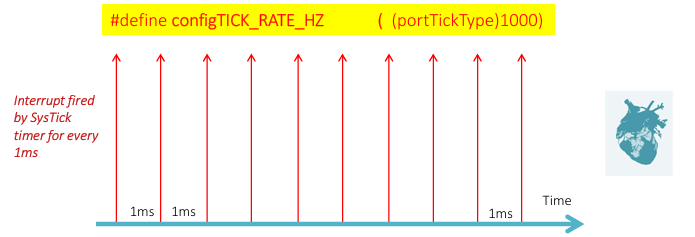
- RTOS Tick dùng để theo dõi thời gian đã trôi qua
- Cấu hình configTICK_RATE_HZ trong FreeRTOSConfig.h     
    - ``ví dụ:`` Nếu configCPU_CLK_HZ = 16000000 + configTICK_RATE_HZ = 1000Hz. => portSYSTICK_NVIC_LOAD_REG = (configCPU_CLK_HZ/configTICK_RATE_HZ) -1 = 15999     
    - => khi bộ đếm(Timer) đếm đến 15999->0 ngắt SysTick được tạo ra. Thời gian sảy ra ngắt 1ms
- Biến toàn cục xTickCount, và nó được tăng lên một bất cứ khi nào ngắt SysTick xảy ra

- RTOS Tick Được sử dụng để chuyển đổi ngữ cảnh sang Nhiệm vụ tiềm năng tiếp theo     
    - ISR tích tắc chạy
    - Tất cả các nhiệm vụ trạng thái sẵn sàng được quét
    - Xác định nhiệm vụ tiềm năng tiếp theo sẽ chạy
    - Nếu tìm thấy, kích hoạt chuyển đổi ngữ cảnh bằng cách đang chờ ngắt PendSV
    - Trình xử lý PendSV đảm nhiệm việc chuyển đổi ra khỏi nhiệm vụ cũ và chuyển đổi vào nhiệm vụ mới

### APIs
#### 1. xTimerCreate
``` C
/*
    @brief: khi RTOS_Tick đếm đến xTimerPeriod thì thực thi pxCallbackFunction
*/
TimerHandle_t xTimerCreate( const char * const pcTimerName,
                            const TickType_t xTimerPeriod,
                            const UBaseType_t uxAutoReload,
                            void * const pvTimerID,
                            TimerCallbackFunction_t pxCallbackFunction );
```
#### 2. Callback function implement
``` C
void pxCallbackFunction( TimerHandle_t xTimer )
{
    // code
}
```
#### 4. xTimerStart
``` C
BaseType_t xTimerStart( TimerHandle_t xTimer, TickType_t xBlockTime );
```
#### 5. xTimerStop
``` C
BaseType_t xTimerStop( TimerHandle_t xTimer, TickType_t xBlockTime );
```
#### 6. pvTimerGetTimerID
``` C
void *pvTimerGetTimerID( TimerHandle_t xTimer );
```
